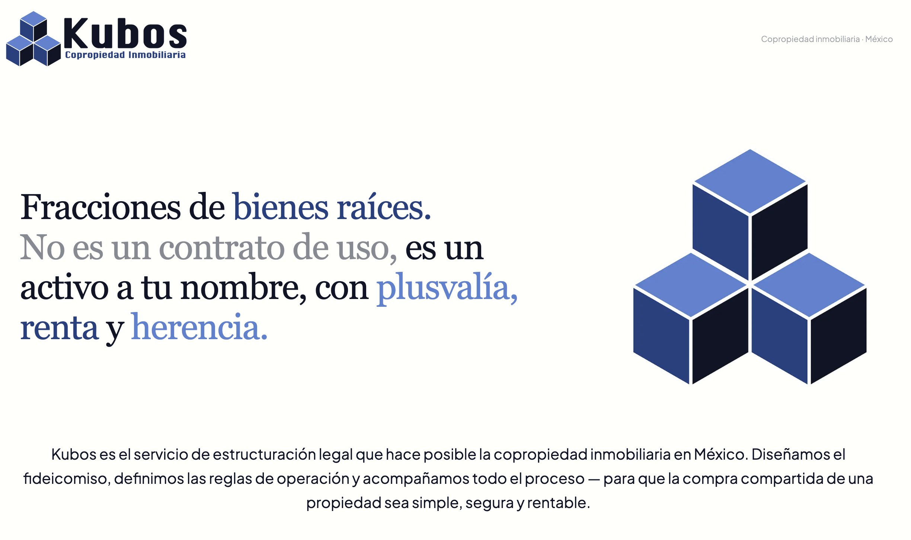

# Kubos Web



Landing page para **Kubos**, servicio de estructuración legal para copropiedad inmobiliaria en México mediante fideicomisos bancarios. Producto de RE/invent.

## Stack

- **Next.js 16** + **React 19** + **TypeScript**
- **Tailwind CSS v4** (tokens definidos en `globals.css` vía `@theme`)
- `next-mdx-remote` para páginas legales desde Markdown
- `@vercel/analytics` + Google Tag Manager

## Estructura

```
app/
  page.tsx          # Homepage
  layout.tsx        # RootLayout, metadata OG, GTM
  privacidad/       # Página de privacidad
  terminos/         # Términos y condiciones
  robots.ts         # SEO
  sitemap.ts        # SEO
components/         # Nav, Hero, QueHacemos, Fideicomiso, Servicios, Destinos, Footer
content/            # Markdown para páginas legales
public/             # Logos, favicons, OG image
```

## Desarrollo

```bash
npm install
npm run dev
```

Abre [http://localhost:3000](http://localhost:3000) en tu navegador.

## Producción

Sitio en vivo: [kubos.com.mx](https://kubos.com.mx)
